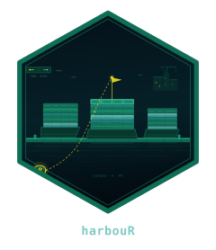

<!-- README.md is generated from README.Rmd. Please edit that file. -->

# harbouR 

<!-- badges: start -->

[](https://github.com/CTTIR/harbouR/actions/workflows/R-CMD-check.yaml)
[](https://cttir.github.io/harbouR/)
[](https://app.codecov.io/gh/CTTIR/harbouR?branch=main)
[](https://opensource.org/licenses/MIT)
[](https://lifecycle.r-lib.org/articles/stages.html#experimental)
<!-- badges: end -->
<!-- The CRAN status and download badges belong here once harbouR is
     accepted. Until then their link target, CRAN.R-project.org/package=harbouR,
     is a 404, and a submission carrying a broken URL gets bounced:

[](https://CRAN.R-project.org/package=harbouR)
[](https://cran.r-project.org/package=harbouR)
[](https://cran.r-project.org/package=harbouR)
-->

**harbouR** is an unofficial R client for working with
[SeaTable](https://seatable.com/) data from R — either from a **local
`.dtable` file**, with no server involved at all, or from a
**self-hosted SeaTable server** over its REST API. Results come back as
tidy tibbles through a column-type-aware coercion layer that makes a
base feel like a set of data frames.

harbouR is written for people who run their own SeaTable Server, or who
simply have an exported `.dtable` file and want to analyse it. The two
paths share one vocabulary: `hb_list_tables()`, `hb_read_table()` and
friends work the same whether the base is a file on disk or a server you
administer.

> SeaTable is a trademark of SeaTable GmbH; this package is not
> affiliated with or endorsed by SeaTable GmbH.

## Installation

``` r
# install.packages("pak")
pak::pak("CTTIR/harbouR")
```

## Quick example

``` r
library(harbouR)

client <- hb_client(
  server    = Sys.getenv("SEATABLE_SERVER"),
  api_token = Sys.getenv("SEATABLE_API_TOKEN")
)

hb_list_tables(client)
samples <- hb_read_table(client, "Samples")
samples |>
  dplyr::filter(.data$Status == "ready") |>
  dplyr::arrange(.data$Collected)
```

Everything in harbouR also works fully offline against bundled example
data — handy for exploring the data model before you connect anything:

``` r
library(harbouR)

meta <- hb_example_metadata()
tibble::as_tibble(meta)
#> # A tibble: 2 × 3
#>   name     n_columns n_views
#>   <chr>        <int>   <int>
#> 1 Samples          7       1
#> 2 Patients         4       1

hb_example_rows("Samples")
#> # A tibble: 3 × 8
#>   Name  Concentration Status  Tags   Collected           Collaborators Reports
#>   <chr>         <dbl> <chr>   <list> <dttm>              <list>        <list> 
#> 1 S-001          12.4 draft   <chr>  2026-04-01 09:00:00 <chr [1]>     <list> 
#> 2 S-002           8.1 ready   <chr>  2026-04-03 12:30:00 <chr [2]>     <list> 
#> 3 S-003          21   shipped <chr>  2026-04-05 16:15:00 <chr [0]>     <list> 
#> # ℹ 1 more variable: `_id` <chr>
```

## Working offline

harbouR reads and writes SeaTable’s own `.dtable` export, so an analysis
can run with no server at all. The same verbs work either way:

``` r
path <- system.file("extdata", "example.dtable", package = "harbouR")
base <- hb_read_dtable(path)

hb_list_tables(base)
#> # A tibble: 2 × 4
#>   name      n_rows n_columns n_views
#>   <chr>      <int>     <int>   <int>
#> 1 Samples        2        27       1
#> 2 Reference      2         2       1
hb_read_table(base, "Samples")[, 1:4]
#> # A tibble: 2 × 4
#>   Name  Notes                        Concentration Share
#>   <chr> <chr>                                <dbl> <dbl>
#> 1 S-001 A plain **markdown** string.      0.000587  0.42
#> 2 S-002 Rendered elsewhere.               8.1      NA
```

Writing one back is lossless, and `hb_dtable()` builds a base out of
ordinary data frames so you can import R results into SeaTable:

``` r
hb_write_dtable(base, "my-base.dtable")

hb_dtable(Measurements = my_data) |>
  hb_write_dtable("for-seatable.dtable")
```

## Interactive explorer

`hb_run_explorer()` launches a Shiny app for inspecting any base
interactively, with a demo mode that needs no credentials.

## Roadmap

harbouR covers the parts of the SeaTable API you need to get data in and
out: authentication, metadata, rows, tables, columns, views and files.
Not yet wrapped, in rough order of intent:

- **Link columns** - reading and writing row-to-row relationships.
- Comments, snapshots, big-data (archive) storage, share links and
  webhooks.
- Server-side import/export, and the admin, team and scheduler
  endpoints.

Earlier releases exported these as stubs that raised “not yet
implemented”. They no longer exist: a function you can call is a promise
that it works. Track progress or request one at
<https://github.com/CTTIR/harbouR/issues>.

## Citation

If harbouR contributes to work you publish, please cite it. The entry is
generated from the package metadata, so it always matches the version
you have installed:

``` r
citation("harbouR")
#> To cite harbouR in publications, please use:
#> 
#>   Heller R, Elsinghorst P, Derz W, Ring M, Achatz G, Forstmeier V
#>   (2026). _harbouR: R Client for SeaTable Collaborative Databases_. R
#>   package version 0.1.0, <https://github.com/CTTIR/harbouR>.
#> 
#> A BibTeX entry for LaTeX users is
#> 
#>   @Manual{,
#>     title = {{harbouR}: R Client for {SeaTable} Collaborative Databases},
#>     author = {Raban Heller and Paul Elsinghorst and Wiebke Derz and Matthias Ring and Gerhard Achatz and Vinzent Forstmeier},
#>     year = {2026},
#>     note = {R package version 0.1.0},
#>     url = {https://github.com/CTTIR/harbouR},
#>   }
```

## Authors

harbouR is by Raban Heller, Paul Elsinghorst, Wiebke Derz, Matthias
Ring, Gerhard Achatz and Vinzent Forstmeier. It grew out of their needs,
field testing and data.

## What harbouR is for

harbouR is written for two things:

1.  **SeaTable data files** — reading and writing a `.dtable` export
    directly, with no server involved at all.
2.  **A SeaTable Server you run yourself** — over its REST API, with
    credentials your own installation issues.

That is the intended scope, and it is what the documentation, examples
and tests describe. `hb_client()` takes a server URL as an argument and
makes no judgement about which host you give it; this is a statement of
what the package is built and documented for, not a technical
restriction.

## Trademarks and affiliation

harbouR is an independent, third-party client. It is **not** affiliated
with, endorsed by, sponsored by, or officially connected to SeaTable
GmbH. Please raise anything about harbouR
[here](https://github.com/CTTIR/harbouR/issues), not with SeaTable GmbH.

SeaTable is a trademark of SeaTable GmbH, 117er Ehrenhof 5, 55118 Mainz,
Germany (Amtsgericht Mainz, HRB 49723). harbouR uses the name only to
identify the service it talks to, claims no right in the mark, and ships
none of SeaTable GmbH’s logos or brand assets — the harbouR logo is an
original work.

harbouR contains no SeaTable server code. It communicates with a
SeaTable server through the public REST API that SeaTable GmbH
[documents](https://api.seatable.com/) for third-party applications.
Your use of SeaTable itself is governed by your agreement with SeaTable
GmbH, not by this package’s licence, and harbouR is provided without
warranty (see
[LICENSE](https://github.com/CTTIR/harbouR/blob/main/LICENSE.md)).

The full notice is in
[NOTICE.md](https://github.com/CTTIR/harbouR/blob/main/NOTICE.md).

## Acknowledgements

harbouR is a client. Everything it does rests on work SeaTable GmbH and
Seafile Ltd. did first, and on a series of decisions they made about how
open that work would be.

- **They publish the API contract, not just prose about it.** The
  OpenAPI 3.0 specification is a public repository
  ([seatable/openapi](https://github.com/seatable/openapi)) covering 387
  operations, kept on one branch per server version from v4.0 to v6.2 —
  so the contract a release promised stays available after that release
  is gone. Their CI rejects a specification whose operations lack a
  summary, description, tag or security scheme.
- **The documentation is open to everyone.** The full reference at
  <https://api.seatable.com/> reads without an account, registration or
  payment, and the admin and developer manuals are public repositories
  that invite pull requests.
- **They write down what they break.** The public API changelog records
  removals as plainly as additions: `/dtable-server` and `/dtable-db`
  were deprecated in 5.2 and removed in 5.3, with dates. harbouR was
  aimed at exactly those endpoints. Without that changelog this package
  would still be talking to an API that no longer exists — not a
  hypothetical benefit.
- **They support people building on top.** The official Python and PHP
  clients are Apache-2.0, as are `dtable-sdk` and the HTML-page SDK; the
  n8n nodes are MIT. The community forum has a Developer Talk category
  for API questions.
- **You can run it yourself.** SeaTable Server can be self-hosted, and
  the Developer Edition needs no licence key — it is described as being
  for [“developers and small teams using SeaTable as a database backend
  via APIs and
  scripts”](https://admin.seatable.com/introduction/editions/), which is
  precisely what harbouR is for. On your own server you decide which API
  limits apply, or whether any apply at all.

To be accurate rather than flattering: SeaTable Server is **not** open
source — the component holding the tables, `dtable-server`, is
proprietary. What carries a recognised open licence are the official
client libraries and SDKs (Apache-2.0) and the n8n nodes (MIT).

The OpenAPI specification and the reference are published publicly and
readable without registration, but they carry no open licence — and
harbouR does not need one. It reproduces no documentation prose; what it
uses are endpoint paths, verbs and JSON field names, which Article 1(2)
of Directive 2009/24/EC excludes from copyright protection as the ideas
and principles underlying an interface (CJEU, *SAS Institute v World
Programming*, C-406/10). SeaTable’s own dtable-server EULA agrees: it
defines applications talking to the Server over its API as “third-party
software” and states that “\[t\]he provisions of the EULA do not apply
to any such third-party
software”([source](https://admin.seatable.com/introduction/dtable-server-license/)).

SeaTable is developed by Seafile Ltd. (Beijing), which grew it out of
the Seafile project; SeaTable GmbH (Mainz), founded in July 2020 by
Dr. Ralf Dyllick-Brenzinger and Christoph Dyllick-Brenzinger, is the
German company behind it. Thanks are owed to both. If SeaTable is useful
to you, support them at <https://seatable.com/>.
